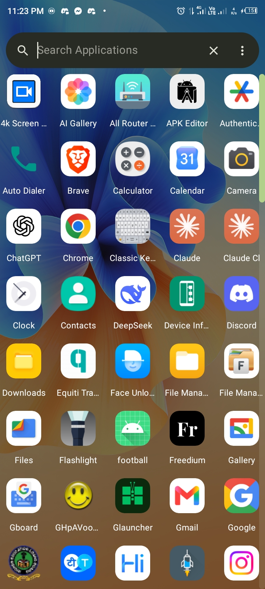
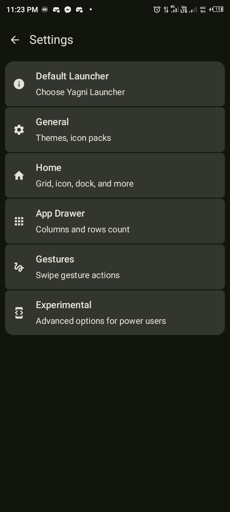
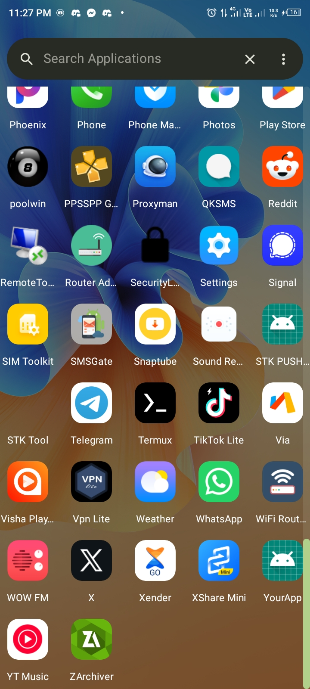
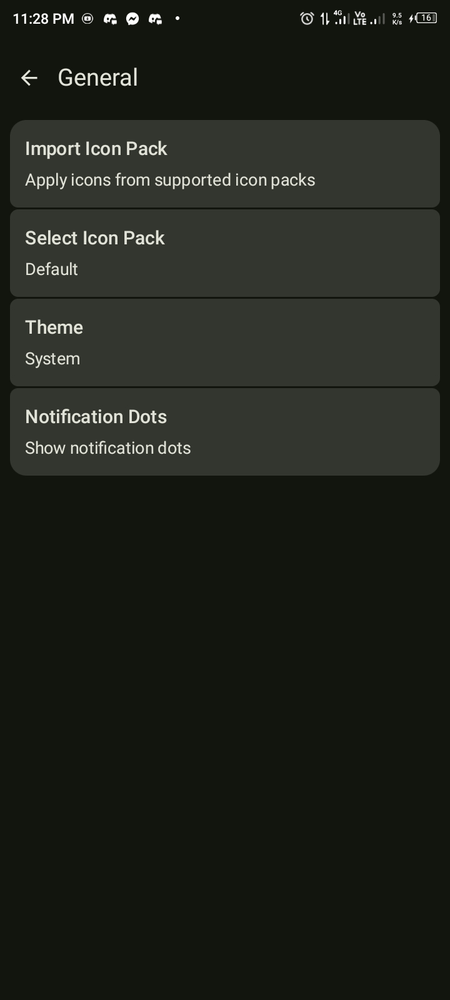
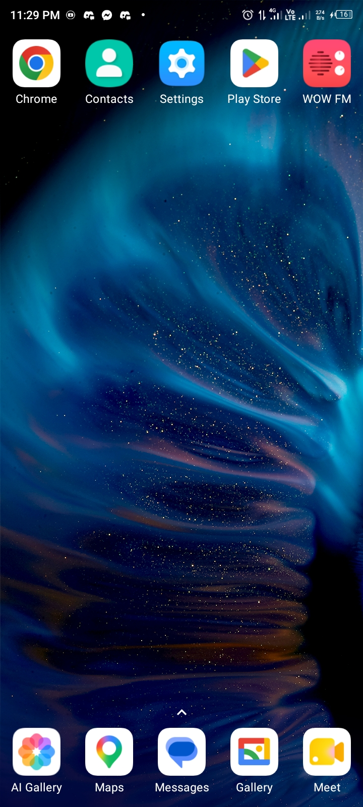
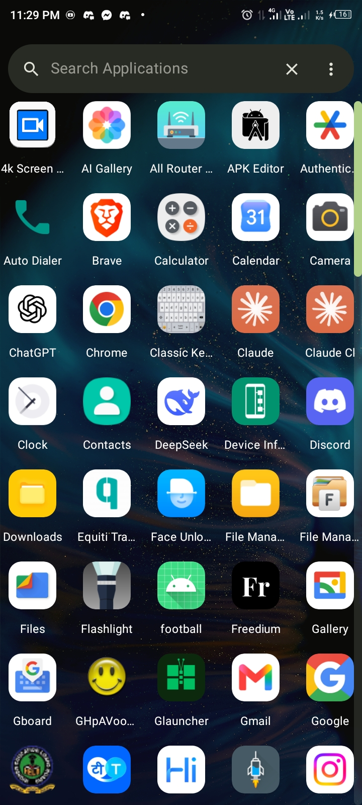

# Yagn Launcher changed to •• Glauncher

Stock Android Launcher From Scratch

> [!WARNING]
> This is an Alpha Stage Build. Expect bugs, instability, and incomplete features.

> [!NOTE]
> AI tools (like CodeRabbitAI) are welcome here and help me review PRs, but no bot-submitted PRs or unreviewed **AI slop**. Every contribution must be understood and stood behind by a human. Meow 🐱

## About The Project

Closed-source launchers are locking features behind paywalls and adding trackers. My goal is to offer powerful features with no compromises on privacy.

**YAGNI ("You Aren't Gonna Need It")** is a principle which arose from extreme programming (XP) that states a programmer should not add functionality until deemed necessary.

## Why Choose Yagni Launcher?

The launcher is the first thing you see every time you unlock your phone. It shouldn't be slow, heavy, or draining your battery in the background.

There are a lot of launchers out there. What sets Yagni Launcher apart is a relentless focus on performance and user experience over feature bloat.

Yagni Launcher matches stock launcher functionality and goes beyond it, rebuilt from scratch with modern Android tooling.

- ⚡ Fast — Built with Kotlin & Jetpack Compose, no legacy overhead
- 🪶 Small — ~2MB total size, 80–90% smaller than typical stock launchers (which often run 10–60MB+)
- 🔋 Efficient — Minimal resource and battery footprint
- 🛠️ Modern — 100% Kotlin, 100% Jetpack Compose, written from the ground up (no forked codebase)

If it's not something you need, it's not in the app. That's the whole philosophy behind the name and it's why Yagni Launcher stays fast where others get slower with every update.

## Screenshots

## Documentation
If you're interested in contributing to the project, I recommend reading the [Yagni Launcher Architecture](docs/ARCHITECTURE.md) first.

## License
**Yagni Launcher** is licensed under the GNU General Public License v3.0. See the [license](LICENSE)
for more
information.
